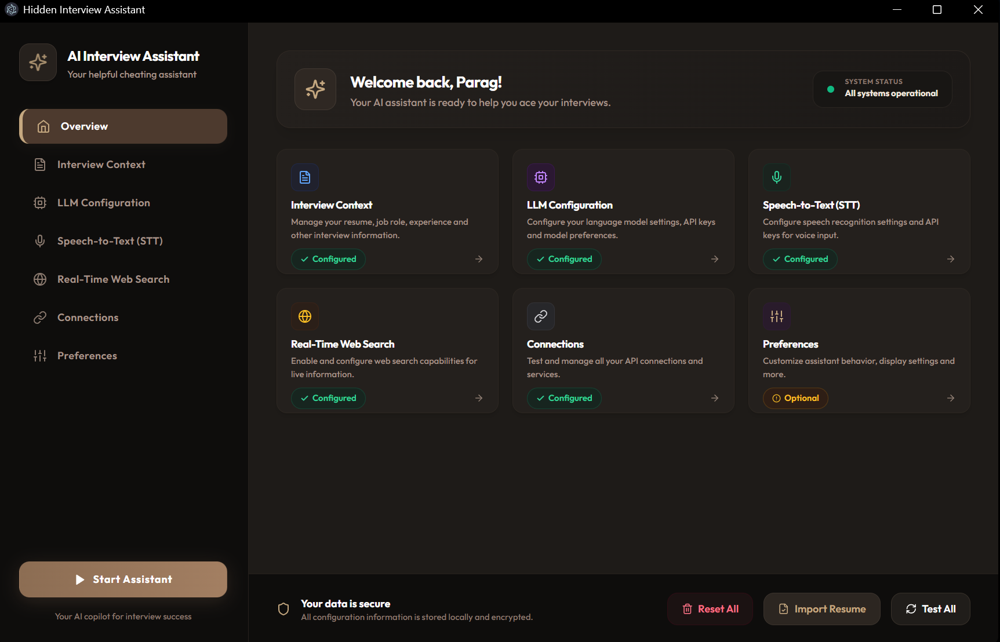
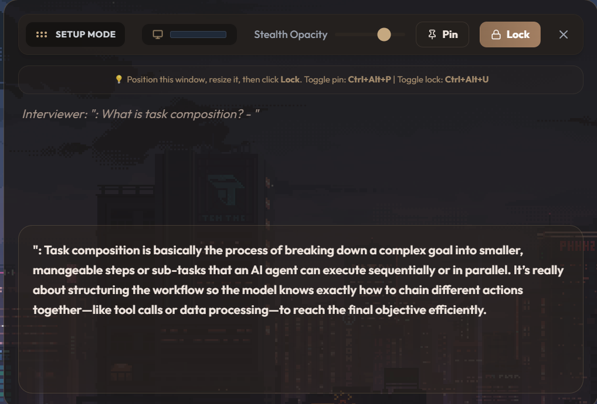
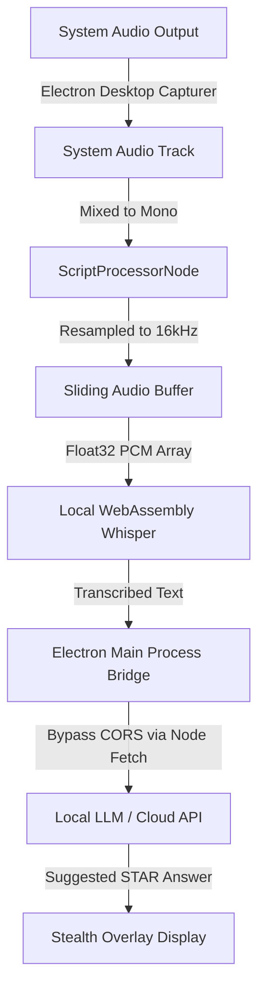

# Cadburry AI: Hidden Real-Time Interview Assistant

Cadburry AI is a stealthy, real-time desktop assistant designed to help candidates answer interview questions confidently. It captures system audio (the interviewer's voice), transcribes it locally using WebAssembly Whisper STT, and uses local or cloud-based LLMs to generate instant, context-aware suggestions based on your Resume and the target Job Description.

Designed for complete discretion, Cadburry AI runs a dual-window interface featuring a protected overlay window that is hidden from screen sharing and recording software.

## Product Screenshots

### 🖥️ Main Configuration Dashboard

*Unified dark-mode dashboard featuring modern sidebar navigation, dynamic OS username greeting, native file upload and drag-and-drop resume importing, and built-in diagnostics.*

### 🔒 Stealth Mode Overlay

*Transparent response display that ignores mouse clicks and is hardware-protected from screen-sharing tools (Zoom, OBS, Teams).*

---

## Table of Contents
1. [Product Screenshots](#product-screenshots)
2. [How It Works](#how-it-works)
3. [Stealth UI System](#stealth-ui-system)
4. [Setup & Installation](#setup--installation)
5. [LLM & STT Configuration](#llm--stt-configuration)
6. [Git Workflow Guide (How to Branch & Post)](#git-workflow-guide-how-to-branch--post)

---

## How It Works



### 1. Loopback Audio Capture
The application captures Windows system audio (your speakers/headphones) using Electron's native `desktopCapturer` combined with the Chromium Web Audio API. 
* To ensure zero microphone distractions, your own microphone input is muted. Only the interviewer's voice is processed.
* The system audio is downmixed to mono and resampled on-the-fly to **16kHz**, which is the optimal sample rate for Whisper speech recognition.
* A rolling **20-second sliding buffer** holds the latest active conversation window.

### 2. Local Whisper Speech-to-Text (STT)
When using the local STT option, transcription runs entirely offline on your computer. It utilizes **Hugging Face's Transformers.js** running **ONNX Runtime WebAssembly**. 
* On the first run, the app downloads the `whisper-tiny.en` model (~75MB) and caches it in your browser cache.
* Every 5 seconds, the raw audio buffer is fed into the WASM pipeline. Transcription is extremely fast, taking less than 500ms on most modern CPUs.

### 3. Server-Side IPC Bridge (CORS Bypass)
Browsers block web requests to other local ports (like LM Studio on `localhost:1234`) or cloud endpoints if CORS headers are missing. To bypass this, Cadburry AI routes all connection tests and LLM inference calls from the React frontend to the Node.js **Electron Main Process** via Inter-Process Communication (IPC). The main process makes the API call server-side, bypassing browser security layers.

---

## Stealth UI System

Cadburry AI features a **Setup vs. Stealth Lock** workflow to make placement easy and hidden during interviews:

1. **Unlocked (Setup Mode)**: 
   * When launched, the overlay is fully interactive.
   * You can drag it by the top header bar, resize it by dragging the window edges, and adjust the opacity slider.
   * Visual volume bars show system audio levels in real time to verify capture is active.
2. **Locked (Stealth Mode)**:
   * Clicking **Lock 🔓** disables all pointer events (`setIgnoreMouseEvents` is activated).
   * The control header, borders, and volume bars disappear, leaving only a faint text overlay.
   * Any mouse click on the overlay goes directly through it to the window beneath.
3. **Unlocking**:
   * If you need to relocate or resize the overlay, click **Unlock Overlay** on the Main Dashboard window.

> [!IMPORTANT]
> The Stealth Overlay window is configured with native OS content protection flags (`setContentProtection(true)`). It is automatically excluded from screen-sharing tools like Zoom, Microsoft Teams, Discord, Google Meet, and OBS, appearing as a blank/invisible box to viewers.

---

## Setup & Installation

### Prerequisites
* **Node.js** (v18 or higher)
* **LM Studio** (Optional, for running local LLMs offline)

### Step-by-Step Installation
1. Clone the repository:
   ```bash
   git clone https://github.com/paragdhersarepaisewala/Cadburry-AI.git
   cd "Hidden INterview assistent"
   ```
2. Install npm packages:
   ```bash
   npm install
   ```

### How to Run in Development Mode
To run the application locally with hot-reloading active:
1. Compile the Electron background process:
   ```bash
   npm run build:electron
   ```
2. Boot up the Vite frontend development server (first terminal window):
   ```bash
   npm run dev
   ```
3. Launch the Electron shell window (second terminal window):
   ```bash
   npm run electron:dev
   ```

### How to Build & Package as a Standalone Desktop Application (.exe)
To package the app into a production-ready, standalone desktop executable that runs without node or terminals:
1. Run the build script:
   ```bash
   npm run build
   ```
2. Locate the packaged installer:
   * The script compiles the React code, bundles the Electron main script, and creates a setup installer inside the `/out` directory.
   * Open the `/out` directory and run the generated installer file (e.g. `hidden-interview-assistant Setup.exe`) to install it natively on your Windows desktop.

---

## LLM & STT Configuration

### 1. Context Configuration
Paste your **Resume / Experience** and the target **Job Description** in the main dashboard context areas. The application saves these automatically to local storage so you do not need to re-paste them on restart.

### 2. Local LLM (LM Studio)
1. Launch **LM Studio**.
2. Download and load a text generation model (e.g. `gemma-2-9b` or similar).
3. Enable the **Local Server** in the left sidebar. Make sure it is running on port `1234` (URL: `http://localhost:1234`).
4. In Cadburry AI's configuration, set the provider to **Local: LM Studio (localhost)**.
5. In **LM Studio Server URL**, enter: `http://127.0.0.1:1234/v1`
6. Enter the model ID as shown in LM Studio under model settings (e.g., `google/gemma-2-9b-it`).
7. Click **Test Connections** to verify the server status.

### 3. Cloud LLM (Gemini)
1. Set the provider to **Cloud: Google (Gemini 1.5)**.
2. Retrieve an API Key from Google AI Studio.
3. Paste the key in the **Gemini API Key** field.
4. Click **Test Connections** to verify the API key is active.

### 4. Local STT (Whisper)
1. On the dashboard, go to the Speech-to-Text section.
2. Select **Local Whisper (transformers.js - FREE)**.
3. Click **Start Assistant**. A progress loader will appear while downloading the ONNX model files.

### 5. Nvidia NIM Configuration
1. Select **Cloud: Nvidia NIM** from the provider dropdown.
2. Enter your Nvidia API Key (`nvapi-...`).
3. Set your Model Name (e.g. `meta/llama-3.1-70b-instruct`).
4. (Optional) Customize the endpoint URL (defaults to `https://integrate.api.nvidia.com/v1`).

### 6. Real-Time Web Search (RAG) using Tavily
1. To enable search, navigate to the **Real-Time Web Search (RAG)** configuration card.
2. Enter your Tavily API Key (`tvly-...`).
3. Once configured, the assistant will automatically analyze the interviewer's query. If it requires external or time-sensitive tech data, it will perform a web search and append relevant search context to the LLM context automatically before answering.

---

## Git Workflow Guide (How to Branch & Post)

To maintain clean repository management, follow these standard git practices.

### Creating and Switching Branches
Always work on a feature branch rather than committing directly to `main`.

1. Check your current branch:
   ```bash
   git branch
   ```
2. Create a new branch for a feature (e.g., `feature/improve-prompts`):
   ```bash
   git checkout -b feature/improve-prompts
   ```
3. To switch back to the main branch:
   ```bash
   git checkout main
   ```

### Staging, Committing, and Pushing Updates ("Posting")
When you have made improvements, stage and push your branch to the remote origin.

1. View modified and unstaged files:
   ```bash
   git status
   ```
2. Stage all modifications:
   ```bash
   git add .
   ```
3. Commit your changes with a descriptive message:
   ```bash
   git commit -m "feat: updated prompting template to improve STAR formatting response"
   ```
4. Push your branch to GitHub:
   ```bash
   git push origin feature/improve-prompts
   ```
5. Merge your feature into main (via Pull Request on GitHub or locally):
   ```bash
   git checkout main
   git merge feature/improve-prompts
   git push origin main
   ```
